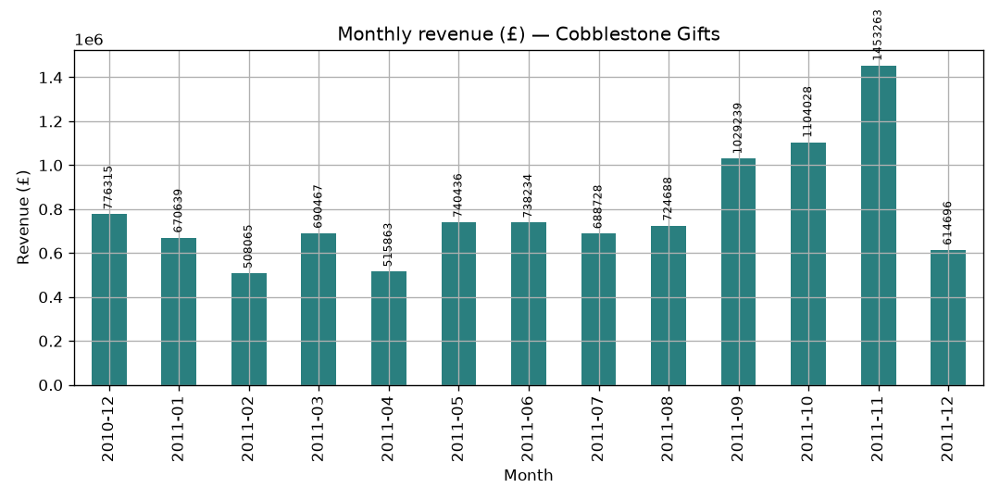
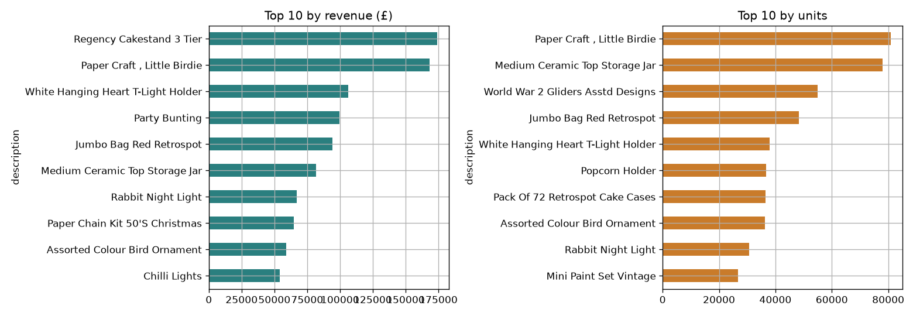
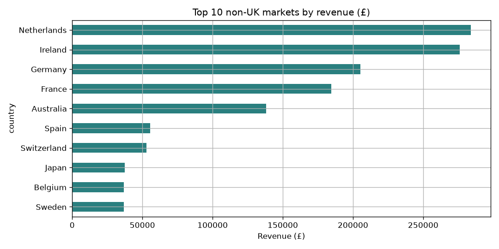

# Findings Summary — Cobblestone Gifts

*Prepared for the Head of Commercial. All figures come from the cleaned completed-sales dataset
(`clean_online_retail.csv`, 522,685 lines, Dec 2010 – Dec 2011).*

## 1. Seasonality
**Total revenue for the year ≈ £10.25M.** Revenue builds through the autumn and peaks in
**November 2011 (≈ £1.45M)** — about **84% above an average month**. Demand is highly seasonal:
plan stock, capacity, and staffing around the Sep–Nov gift-buying run-up. *(December 2011 is a
partial month and looks low only because the data ends early.)*

## 2. Best sellers
The **top 10 by revenue** and **top 10 by units** overlap only partly. Items high on *units* but
not *revenue* are cheap, high-volume impulse/party goods; items high on *revenue* but not *units*
carry a higher price point. **Takeaway:** push volume on the low-price staples, protect margin on
the premium lines.

## 3. Markets
The business is overwhelmingly **UK-based**. The strongest **non-UK** markets by revenue are
**Netherlands (£284k), Ireland (£276k), Germany (£205k), France (£185k), Australia (£138k)**. By
region, **Western Europe** leads the non-UK total. Expansion is best focused where both revenue
**and** the distinct-customer count are healthy (a repeatable market, not one big buyer).

## 4. Customer concentration
Spend is highly concentrated: the **top 1%** of identified customers (≈43 accounts) account for
**~32%** of identified-customer revenue, and the top 10 buyers each spend well into five figures.
This is a **wholesale-driven** business with a long tail of small shoppers — retaining a few large
accounts matters disproportionately.

## 5. Order value
**Average order value:** overall **≈ £519**; **UK ≈ £487** vs **non-UK ≈ £815**. International orders
are far larger — typically wholesalers placing big, infrequent orders worth the shipping. Set
free-shipping / volume thresholds with the higher non-UK basket size in mind.

## 6. Returns & cancellations
Returns/cancellations are **~3% of raw lines** and claw back a meaningful share of gross sales. They
**cluster on a handful of products and a few large accounts** — the same wholesale buyers who place
the biggest orders also generate the biggest reversals. Worth investigating whether these are
data-entry corrections, damaged goods, or genuine cancellations.

## 7. Data-quality memo
We removed **~3.5%** of raw rows as invalid (cancellations, returns, non-positive prices/quantities,
non-product lines, blank descriptions, exact duplicates) and **kept ~96%** as valid sales — including
the ~25% of rows with no customer ID, which are flagged so customer-level analysis can exclude them.

**Would I trust this for a board report? Yes, with two footnotes:**
1. Customer-concentration figures cover only the ~75% of revenue carrying a customer ID — treat them
   as a **lower bound** on concentration.
2. The series ends mid-December 2011, so **never compare the final month like-for-like**.

With those caveats, the revenue, seasonality, market, and best-seller findings are board-grade.
