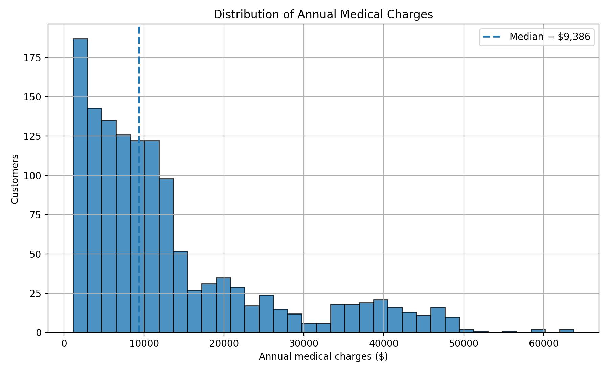
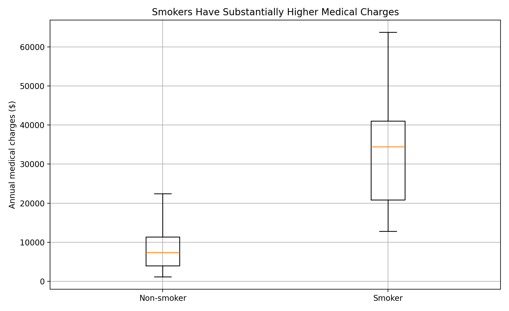
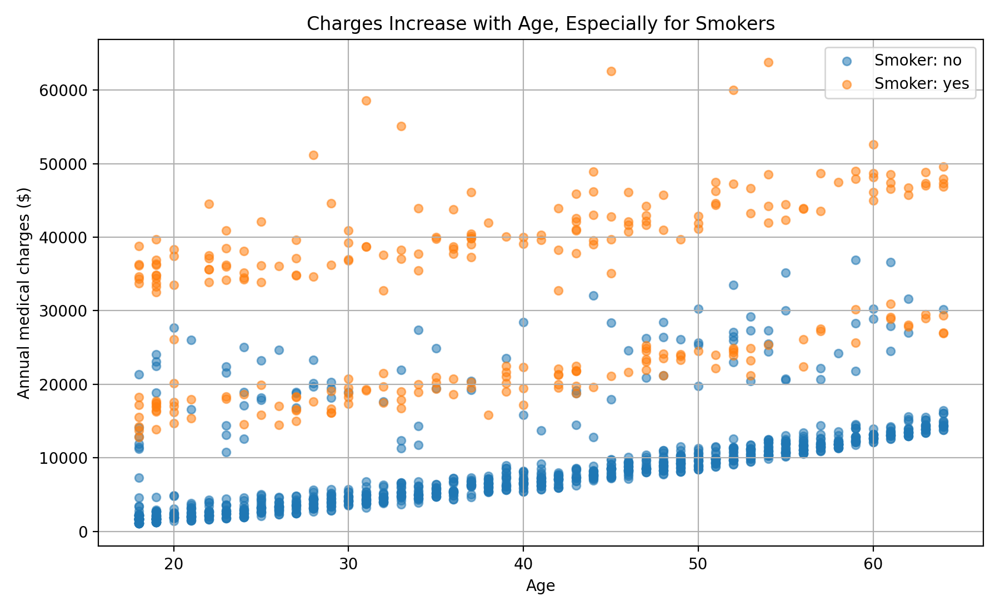
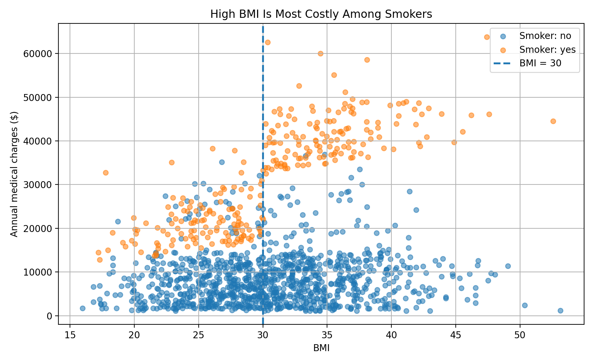
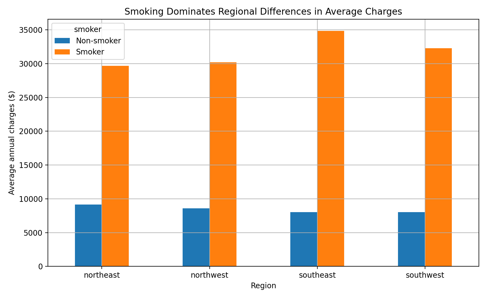
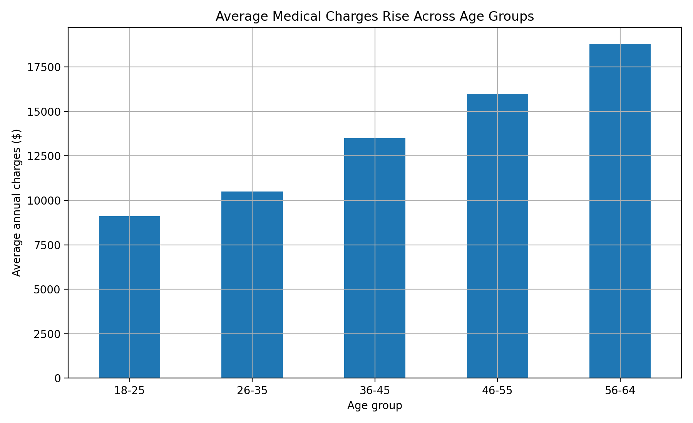
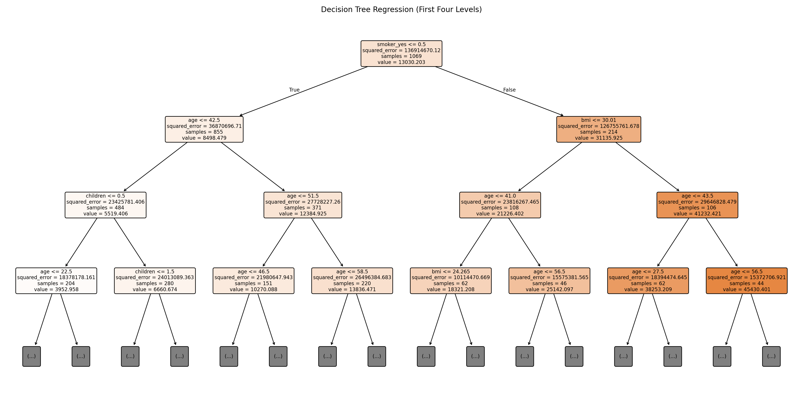
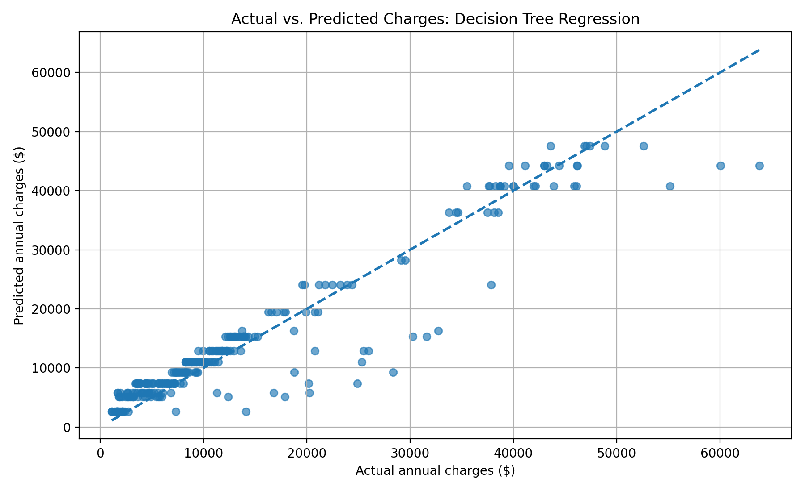
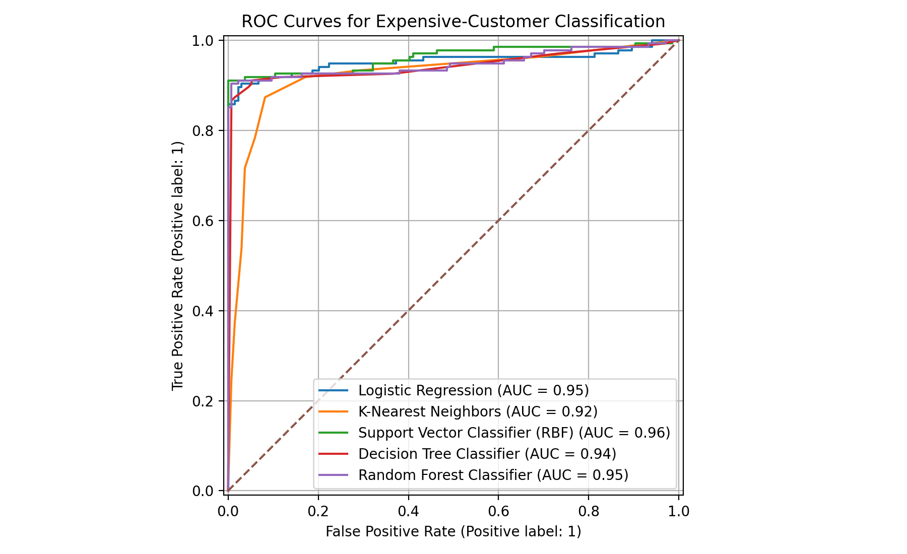
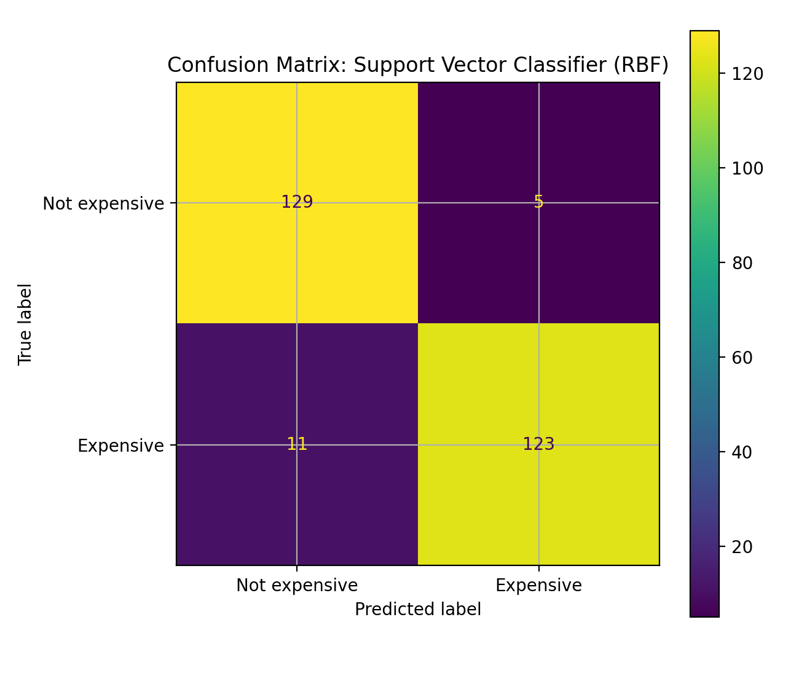

# HealthGuard Insurance: Data-Driven Medical Cost Analysis

**EECE 6544 MiniProject #02**  
**Author:** Majd Khalaf  
**Term:** Summer 2026

## Executive summary

HealthGuard Insurance asked for a data-driven analysis of customer medical charges and two predictive tools: one to estimate annual charges and one to flag customers whose charges are above the portfolio median. The analysis uses 1,338 records with age, sex, BMI, number of children, smoking status, region, and annual medical charges. One exact duplicate was removed, leaving **1,337 unique records**. The raw file contained no missing values.

Smoking is the dominant cost driver. Smokers in the cleaned dataset average **3.80 times** the annual charges of non-smokers. Age has a clear positive association with charges, and BMI is especially important among smokers. Regional and sex differences are comparatively small.

The recommended regression model is a tuned **Decision Tree Regression**, which achieved a test MAE of **$2,621.31**, RMSE of **$4,345.88**, and R² of **0.897**. For classifying customers above the cleaned-data median of **$9,386.16**, the recommended model is the **Support Vector Classifier (RBF)**, with accuracy **0.940**, recall **0.918**, F1 **0.939**, and ROC-AUC **0.961**.

## 1. Data and problem formulation

The dataset is the *Medical Cost Personal Datasets* file provided through Kaggle. Each record includes six customer attributes and the observed annual medical charge. The stakeholder requirements were translated into:

1. Exploratory data analysis to identify the attributes most associated with charges.
2. Regression to predict continuous annual charges.
3. Binary classification, where `expensive = 1` when charges exceed the sample median.

The raw dataset is stored separately from the cleaned output. All transformations return new dataframes rather than mutating the raw dataframe.

## 2. Data cleaning and wrangling

The data was read with a robust encoding fallback, profiled with `head`, `shape`, `info`, `describe`, and `value_counts`, and checked for missing values, duplicates, invalid numeric ranges, and inconsistent categories.

Cleaning actions:

- Standardized column names and lowercased/trimmed categorical text.
- Coerced age, BMI, children, and charges to numeric types.
- Defined broad validity checks for age, BMI, children, and positive charges.
- Removed one exact duplicate row.
- Preserved high-charge records because they are valid and central to the business problem.
- Saved the cleaned data to `outputs/insurance_cleaned.csv`.

The notebook also demonstrates 21 pandas operations on the same dataset: creation/copying, column selection, row selection, filtering, sorting, feature creation, replacement, renaming, missing-value detection, filling, dropping missing rows, dropping conditional rows, dropping columns, duplicate removal, value counts, grouping, aggregation, function application, resampling, concatenation, and merging.

## 3. Exploratory analysis

### 3.1 Charge distribution

Charges are strongly right-skewed. The mean is pulled upward by a smaller set of high-cost customers, which motivates both continuous regression and median-based classification.

### 3.2 Smoking status

Smokers have a clearly separated and substantially higher charge distribution. Smoking is therefore selected as the single predictor for the simple linear-regression baseline.

### 3.3 Age

Charges generally rise with age. The relationship is visible among both smoking groups, but smokers occupy a much higher cost range.

### 3.4 BMI

BMI has a nonlinear relationship with charges. The most striking pattern is the cluster of smokers with BMI at or above 30 and very high annual charges, indicating an interaction between smoking and BMI.

### 3.5 Region and smoking

Regional averages differ, but the smoker/non-smoker gap is much larger than the differences between regions. Region should therefore be treated as a secondary predictor rather than a primary pricing driver.

### 3.6 Age groups

Average charges rise steadily across age groups, supporting age as an important predictor.

### Key EDA conclusions

- Smoking is the strongest observed separator of medical charges.
- Age has a consistent positive association with charges.
- BMI contributes most strongly when combined with smoking.
- Children, sex, and region have weaker raw associations.
- These are associations, not causal estimates.

## 4. Regression modeling

An 80/20 train/test split with random state 42 was used. Numeric predictors were median-imputed and standardized; categorical predictors were mode-imputed and one-hot encoded. All preprocessing was placed inside scikit-learn pipelines to prevent leakage.

The required models were evaluated with MAE, MSE, RMSE, and R². Polynomial degrees 2-4 and two SVR kernels were reported separately.

| Model | MAE | MSE | RMSE | R2 |
|---|---|---|---|---|
| Decision Tree Regression | 2,621.31 | 18,886,631 | 4,345.88 | 0.897 |
| Polynomial Regression (degree 2) | 2,867.32 | 21,585,844 | 4,646.06 | 0.883 |
| SVR (rbf kernel) | 2,313.05 | 23,189,479 | 4,815.55 | 0.874 |
| Polynomial Regression (degree 3) | 3,048.86 | 23,719,530 | 4,870.27 | 0.871 |
| Multiple Linear Regression | 4,177.05 | 35,478,021 | 5,956.34 | 0.807 |
| Ridge Regression | 4,193.89 | 35,663,133 | 5,971.86 | 0.806 |
| Lasso Regression | 4,223.72 | 36,341,054 | 6,028.35 | 0.802 |
| Polynomial Regression (degree 4) | 3,756.15 | 36,697,661 | 6,057.86 | 0.800 |
| SVR (linear kernel) | 3,141.27 | 39,182,560 | 6,259.60 | 0.787 |
| Simple Linear Regression (smoker only) | 5,830.64 | 60,039,304 | 7,748.50 | 0.673 |

### Polynomial overfitting

| Degree | Train_RMSE | Test_RMSE | Train_R2 | Test_R2 |
|---|---|---|---|---|
| 2.0 | 4766.993577718228 | 4646.056793068933 | 0.8340263483080009 | 0.882529897246852 |
| 3.0 | 4575.15716070324 | 4870.269997884933 | 0.8471159954824281 | 0.8709183831506484 |
| 4.0 | 4274.363009456683 | 6057.859428011475 | 0.8665579143519785 | 0.8002914296132311 |

Degree 4 reduced training error but produced the largest train-test gap and much worse test performance. Degree 2 generalized best among the polynomial models.

### Lasso feature elimination

The selected Lasso alpha was 50. It set the coefficients for **sex_male** and **region_northwest** to zero. Smoking remained by far the largest coefficient, followed by age and BMI.

### Regression recommendation

The tuned decision tree used `max_depth=4` and `min_samples_leaf=5`. It had the lowest RMSE and highest R² in the held-out comparison. The constraints prevent an unrestricted tree from memorizing individual records, while still capturing nonlinear effects and interactions.

## 5. Expensive-customer classification

A customer was labeled expensive when annual charges exceeded **$9,386.16**. The train/test split was stratified. Logistic regression, K-nearest neighbors, RBF SVC, decision tree, and random forest models were compared.

| Model | Accuracy | Precision | Recall | F1 | ROC_AUC |
|---|---|---|---|---|---|
| Support Vector Classifier (RBF) | 0.940 | 0.961 | 0.918 | 0.939 | 0.961 |
| Random Forest Classifier | 0.940 | 0.968 | 0.910 | 0.938 | 0.947 |
| Decision Tree Classifier | 0.925 | 0.952 | 0.896 | 0.923 | 0.942 |
| Logistic Regression | 0.907 | 0.898 | 0.918 | 0.908 | 0.953 |
| K-Nearest Neighbors | 0.862 | 0.929 | 0.784 | 0.850 | 0.922 |

### Classification recommendation

The RBF support-vector classifier is recommended. It tied for the highest accuracy and delivered the best F1 and ROC-AUC. Its recall of **0.918** is particularly relevant because a false negative means failing to flag a genuinely expensive customer.

## 6. Final recommendation to HealthGuard

For a prototype charge estimate, use the tuned decision tree regression model. For a simpler operational flag, use the RBF support-vector classifier. The two tools serve different decisions: the regression output supports continuous cost estimation, while the classifier supports triage and review workflows.

These models should not be deployed directly for insurance pricing. HealthGuard should validate them on its own recent claims, compare results across demographic groups, review regulatory constraints, and include actuarial variables such as diagnoses, utilization history, plan design, provider network, and time.